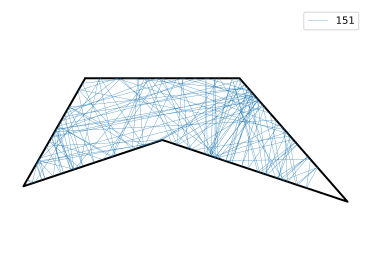

# Cataphote

Dynamical billiard simulation.



Create a billiard, and plot its boundaries:

```python
c = cataphote( [ (-.5,0), (-.9,-.7), (0,-.4), (1.2,-.8), (.5,0), (-.5,0) ] )

c.plot_reflector( color = 'k', lw = 2 )
```
Create a [ray](https://docs.sympy.org/latest/modules/geometry/lines.html?highlight=ray#sympy.geometry.line.Ray), and follow its trajectory:

```python
ray = Ray( (0,0), angle = -0.2*pi/2  )

traj, ray = c.get_trajectory( ray, max_iterations = 150 )

plot( *np.array( traj ).T, label = str( len(traj) ), alpha = 1, lw = .3 )
```
